# Observability Design

> **Status.** This document describes the observability subsystem of the bridge:
> the per-request audit trace, the runtime text log, and the trace-id correlation
> that ties them together. All of it is **as-built**: the `RequestAudit` seam in
> §5 shipped with the tracing-audit refactor (`RequestAudit.cs`, guarded by
> `RequestAuditSeamTests` / `RequestAuditCodexSeamTests`); the rest predates it
> (`fix-summary-trace-id-collision` and the raw-capture work). Sections tagged
> `[implemented]` were added by that refactor; `[as-built]` predates it. This is a
> review/reference doc, not an OpenSpec artifact.
>
> **Audience.** Anyone touching the endpoints, the strategies, or the logging
> pipeline. The invariants in §12 are the contract; the diagrams are the map.

---

## 1. Goals & non-goals

**Goals**

- One request → four self-describing JSON artifacts (`inbound-req`,
  `upstream-req`, `upstream-resp`, `inbound-resp`) that reconstruct exactly what
  crossed each boundary, byte-for-byte.
- One **trace id** stamped on every surface — the four files, the summary line,
  and every in-request log line — so an operator can grep one and find the rest.
- **Zero overhead when tracing is off.** The audit captures full prompts and
  responses, so it is off by default; when off it must cost nothing on the hot
  path — no serialize, no copy, no allocation.
- `upstream-req` records the **exact bytes POSTed** to Copilot, not a
  re-derivation.

**Non-goals**

- The audit is a debugging aid, not a metrics system: no counters, histograms, or
  export. (The per-request **summary line** carries coarse usage/latency; that is
  the closest thing to a metric.)
- No sampling, no rotation of the JSON trace files (one process run, one
  directory; the operator prunes).
- Body scrubbing beyond header redaction (§11) — the wire bodies never carry OAuth
  tokens.

---

## 2. The two channels `[as-built]`

Everything flows through **one** Serilog pipeline, but there are two logical
channels with different destinations, split by whether the log event carries a
`Payload` property.

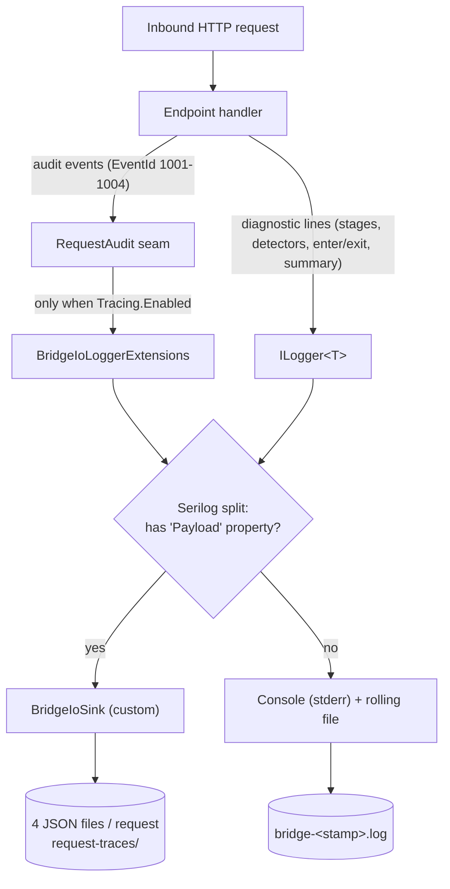

| Channel | Content | Destination | Default |
|---|---|---|---|
| **Audit** | Full request/response bodies, headers, SSE events | `request-traces/<traceId>-*.json` | **off** (`Tracing.Enabled=false`) |
| **Runtime text** | Startup banner, stage/detector debug, errors, per-request summary | `log/bridge-<stamp>.log` + console(stderr) | **on** |

The two are distinct directories (`request-traces/` vs `log/`) and distinct
lifetimes: the text log is always on; the JSON audit is opt-in.

---

## 3. The trace id: one id, every surface `[as-built]`

`BridgeIoSeq` mints a process-monotonic `seq`; `BuildTraceId(seq, utc)` renders
`{yyyyMMdd-HHmmss}-{seq:D4}`. That one string is the join key across every
observability surface for the request.

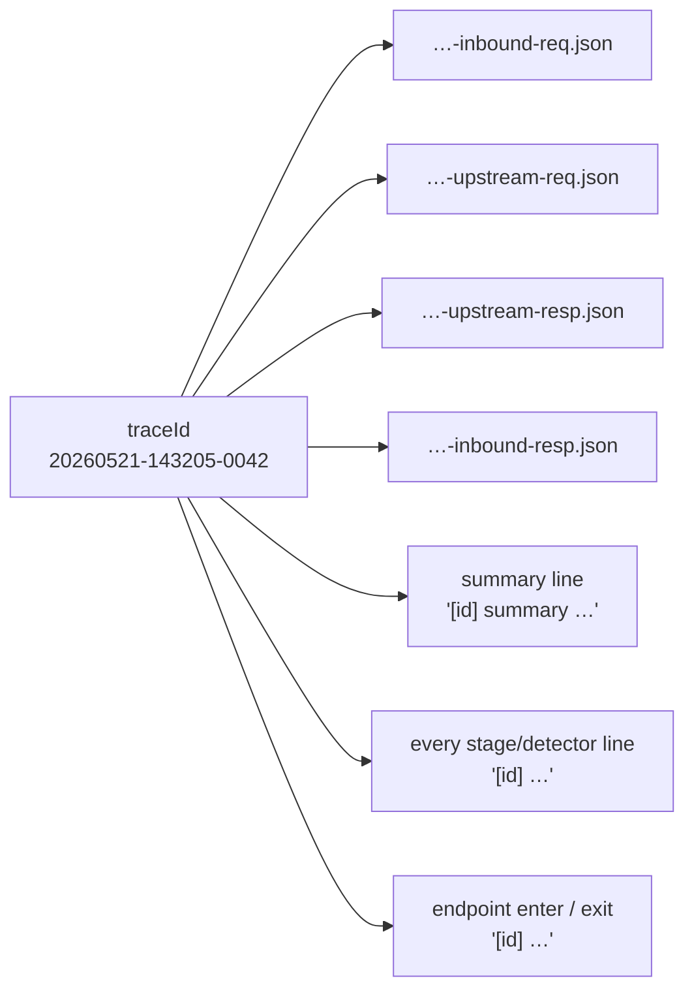

**How the id reaches the text lines.** The endpoint pushes the raw id onto
Serilog's `LogContext` as the property `ReqTrace`, spanning the *whole* handler
(before `enter`, through the `try`, into the `finally` `exit`). `ReqTraceFormatEnricher`
turns `ReqTrace` into the display token `ReqTraceFmt = "[<id>] "`, which the
output templates render as a prefix. No line self-renders its own id — one render
site, so nothing can shadow or double it.

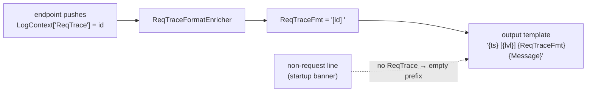

> Why `ReqTrace` and not `TraceId`: the ASP.NET host injects an ambient
> `Activity.TraceId` scope named literally `TraceId`. A message hole named
> `{TraceId}` would be shadowed by it (that was a real bug). Using a distinct
> property name and rendering only via the prefix removes the whole class of
> collision. (Full rationale: the `fix-summary-trace-id-collision` change.)

**How the id reaches the files.** The endpoint passes `traceId` explicitly to
each `Record*` call; the sink names the file `<traceId>-<kind>.json`.

---

## 4. The four artifacts `[as-built]`

Each artifact is a separate file (not one combined record) so an operator can open
one side without dragging in megabytes of streaming response.

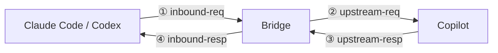

| # | Kind | Captures | Source of truth |
|---|---|---|---|
| ① | `inbound-req` | What the client sent us | raw inbound bytes |
| ② | `upstream-req` | What we POSTed to Copilot | `Response.UpstreamWireBody` (the exact POSTed bytes — see §10) |
| ③ | `upstream-resp` | What Copilot returned, **pre-stage / pre-translation** | `RawUpstreamRespBytesOrNull()` (see §9) |
| ④ | `inbound-resp` | What we sent back, **including dropped SSE events** | outbound bytes + `DroppedEvents` |

The subtlety lives in ② and ③: both must reflect the *wire*, not the bridge's
in-memory IR. ② must be the translated Responses body on a gpt route (not the IR);
③ must be Copilot's original bytes even after a response stage rewrites the model.
Those two are what §9 and §10 exist to guarantee.

### 4.1 Every artifact is the wire, never the IR

The bridge has a **hub-and-spoke** shape: each client's native protocol is
translated to a shared Anthropic-shaped **IR** on the way in (T1), and back out on
the way in-from-Copilot (T4); the Copilot backend has its own native protocol,
reached via T2/T3. The IR is an *internal hub* — **it is never written to any
audit artifact.** Every one of the four files holds the real bytes that crossed
that boundary, in the **native protocol of whichever side owns that boundary**.

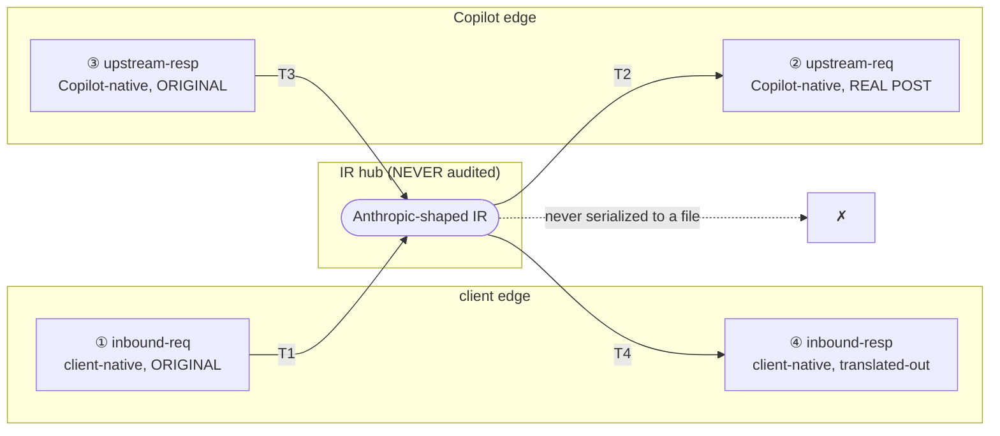

Concretely, for the two client types:

| Boundary | Claude Code (`/cc`) | Codex (`/codex`) | Is it the original / real wire? |
|---|---|---|---|
| ① `inbound-req` | Anthropic Messages, as CC sent it | **Responses, as Codex sent it** | ✅ original client bytes — read *before* T1 builds the IR |
| ② `upstream-req` | Anthropic Messages we POSTed | **Responses (T2 output) we POSTed** | ✅ the exact bytes handed to the Copilot client |
| ③ `upstream-resp` | Anthropic, as Copilot sent it | **Responses, as Copilot sent it** | ✅ Copilot's original bytes — captured *before* T3/T4 |
| ④ `inbound-resp` | Anthropic we returned to CC | **Responses (T4 output) we returned to Codex** | ✅ the exact bytes written back to the client |

So for a Codex request specifically: `inbound-req` is Codex's **original** request
(captured before T1, *not* the IR), and `upstream-req` is the **real** body we
POSTed to Copilot (T2's output). Neither is the IR.

> **Why ① and ② can differ on the Codex path even though both are "Responses".**
> A Codex request is translated *twice* — T1 (Codex-Responses → IR) then T2
> (IR → Copilot-Responses) — with profile/effort/shape adjustments in between. So
> `inbound-req` and `upstream-req` are both Responses-shaped and, when the
> translation reshapes the body, **not byte-identical** — the whole point of
> keeping them as two files: an operator diffs "what Codex sent" against "what we
> actually forwarded". For a trivial request where T1∘T2 is effectively an
> identity, the two Responses bodies may coincide; byte-inequality is
> request-dependent, so it is **not** an invariant. The invariant that always holds
> is the one the tests assert: each artifact is the wire on its side, and **neither
> is the IR** (the IR's required `max_tokens` field is absent from both Responses
> bodies). (On the `/cc` passthrough path the IR *is* the Anthropic wire body, so
> ① and ② differ only by the pipeline's header/body sanitation, not a protocol
> change.)

---

## 5. The `RequestAudit` seam `[implemented]`

Today the single concept *"are we tracing this request?"* is expressed five ways
(a DI-null sink, two strategy `bool` fields, three endpoint locals, `?:`
ternaries, `if` guards) — and, at two sites, **not at all**. The two unguarded
sites re-serialize the request body and stash it unconditionally, doing audit-only
work even when tracing is off. The refactor collapses all of that behind one
per-request scoped service.

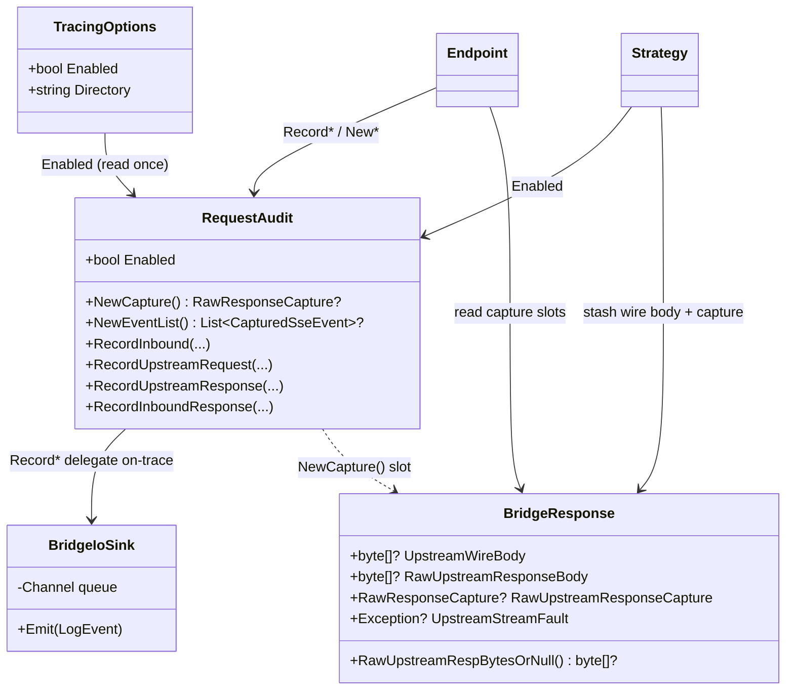

**Contract of the seam:** every method is a cheap no-op when `Enabled == false`.

```
Enabled == false  ⇒  NewCapture()      returns null   (no allocation)
                     NewEventList()    returns null   (no allocation)
                     Record*(...)      returns early  (no payload, no emit)
Enabled == true   ⇒  Record* delegates to BridgeIoLoggerExtensions
                     → byte-identical artifacts to today
```

The seam is a scoped service, same DI shape as `BridgeContext` — the container
builds one per request; endpoints and strategies inject the same instance. The
DI-null **sink** stays (it is the sink's concern, one layer lower), but it is no
longer the place the request path reads the flag.

> **What the seam is NOT.** It does not own the capture *result* slots
> (`RawUpstreamResponseBody`, `RawUpstreamResponseCapture`) — those stay on
> `BridgeResponse` as the strategy→endpoint channel. The seam unifies their
> *gating*, not their location.

---

## 6. On-trace request lifecycle `[as-built + proposed seam]`

The full happy path with tracing **on**. Note the two-phase shape: the endpoint
records `inbound-req` up front (so even an early-return audits), then the three
remaining artifacts land in the `finally` after the response has fully drained.

```mermaid
sequenceDiagram
    autonumber
    participant C as Claude Code
    participant EP as Endpoint
    participant RA as RequestAudit
    participant ST as Strategy
    participant CP as Copilot
    participant SK as BridgeIoSink

    Note over EP: seq = Next()<br/>traceId = BuildTraceId(seq, utc)<br/>push LogContext['ReqTrace']=id
    C->>EP: POST body
    EP->>RA: RecordInbound(seq, id, headers, rawInboundBytes)
    RA->>SK: LogInboundRequest  (Enabled)
    Note over EP: rawInboundBytes = client-native, ORIGINAL<br/>(recorded before T1 builds the IR)

    EP->>ST: ForwardAsync()
    ST->>ST: wireBody = Serialize(IR)   // /cc: Anthropic;  codex: T2 Responses
    Note over ST: wireBody = the REAL Copilot-native POST body,<br/>NOT the IR
    ST->>RA: Enabled? yes
    ST-->>EP: ctx.Response.UpstreamWireBody = wireBody
    ST->>CP: POST wireBody
    CP-->>ST: response
    alt streaming
        Note over ST: tee raw stream into RawResponseCapture
        ST-->>EP: EventStream
        EP->>C: relay events (capture fills lazily)
    else buffered
        ST-->>EP: BufferedBody (+ RawUpstreamResponseBody snapshot)
        EP->>C: write body
    end

    Note over EP: finally
    EP->>RA: RecordUpstreamRequest(UpstreamWireBody)
    EP->>RA: RecordUpstreamResponse(RawUpstreamRespBytesOrNull())
    EP->>RA: RecordInboundResponse(outBody, capturedEvents+dropped)
    RA->>SK: 3 payloads (Enabled)
    SK->>SK: worker writes 4 JSON files
```

Two ordering rules the sequence encodes:

- **`UpstreamWireBody` is set inside `ForwardAsync`, before the POST returns** —
  it is the exact array handed to the client, captured at the one moment it is
  guaranteed correct.
- **`RawUpstreamRespBytesOrNull()` is read in `finally`, after the relay loop
  drains the stream** — the streaming capture is only complete then, and reading
  it *seals* the buffer (§9). Read it once, never mid-stream.

---

## 7. Off-trace: zero overhead `[implemented]`

The same request with tracing **off**. Every seam method short-circuits; the
strategy skips the stash and the tee; the endpoint skips the body copy. The wire
output is byte-identical to the on-trace path.

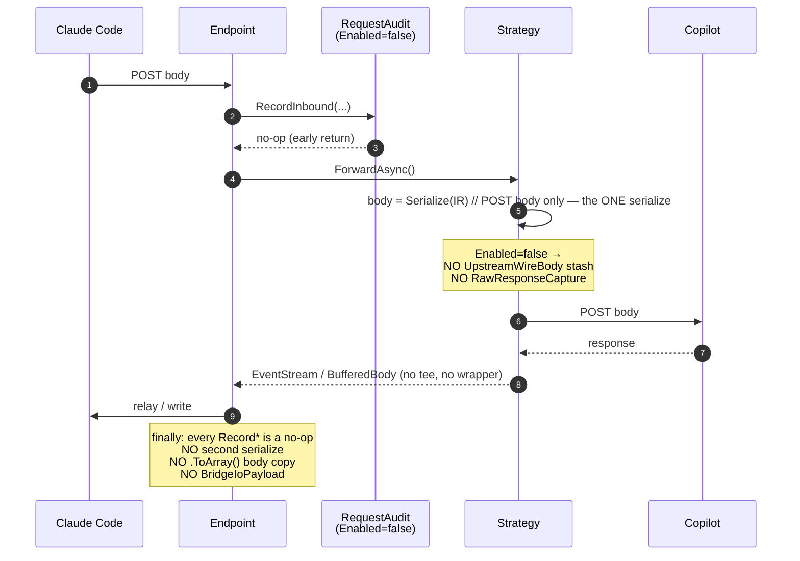

**Two layers of defense make "off ⇒ nothing" true:**

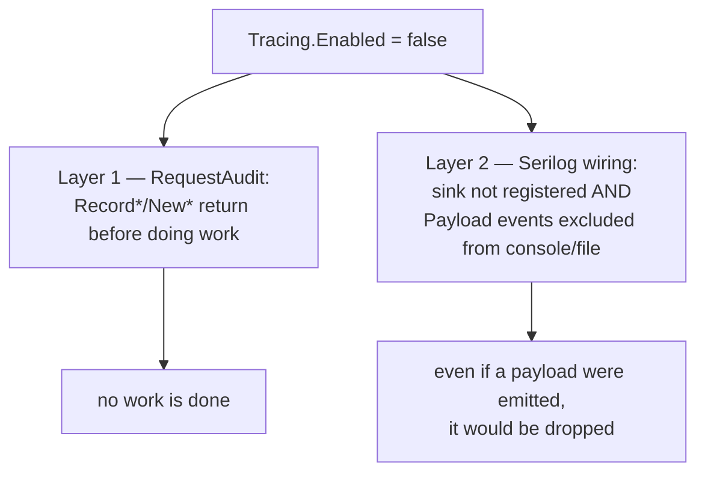

Layer 1 is the seam (the request path never even builds a payload). Layer 2 is the
existing Serilog config — a backstop, not the primary mechanism. Today only Layer
2 exists, so payloads *are* built and then dropped; the seam adds Layer 1, which
is what makes it free.

---

## 8. The Serilog event split `[as-built]`

How an audit event physically becomes a file, and how the split keeps audit bytes
out of the text log.

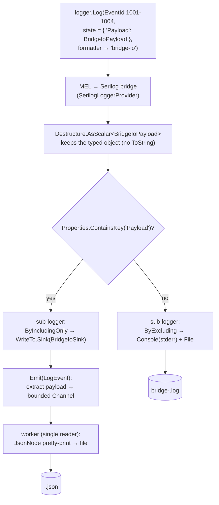

Three easy-to-break details this encodes:

- **`Destructure.AsScalar<BridgeIoPayload>()` is mandatory.** Without it the
  MEL→Serilog bridge calls `.ToString()` on the payload, the sink's
  `scalar.Value is BridgeIoPayload` check fails, and every audit event is silently
  dropped.
- **The split is by property presence**, so a diagnostic line never lands in a
  JSON file and an audit payload never bloats the text log.
- **EventIds 1001–1004** (`BridgeIoEvents`) are the marker; the sink maps them to
  the four `kind` suffixes.

---

## 9. Capturing the raw upstream response `[as-built]`

Artifact ③ (`upstream-resp`) must hold Copilot's **original** bytes — before the
response stages rewrite the model or a translator reshapes the stream. Two modes,
two mechanisms, one accessor.

### 9.1 Streaming — the read-through tee

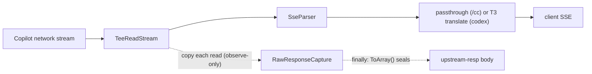

`TeeReadStream` sits between `HttpContent.ReadAsStreamAsync()` and the parser. The
parser drives the reads; the tee copies each read into the capture. It is
**observe-only** and **non-owning**: writes/seeks throw, it never disposes the
inner stream, and a capture-side failure (OOM, size cap) is swallowed so the trace
can never truncate the client's stream.

When tracing is off, `NewCapture()` returns null → no tee is inserted → the parser
reads the raw stream directly (byte-identical, zero wrapper allocation).

### 9.2 Buffered — snapshot before rewrite

For a non-streaming response, the strategy stashes the original array reference the
instant it reads it, **before** any stage can reassign `BufferedBody`:

```
BufferedBody = await ReadAsByteArrayAsync(...)
if (Enabled) RawUpstreamResponseBody = BufferedBody   // same reference, pinned
// ... later, ResponseModelRewriteStage may set BufferedBody = <new array>
// RawUpstreamResponseBody still points at Copilot's original bytes.
```

### 9.3 The accessor and its precedence

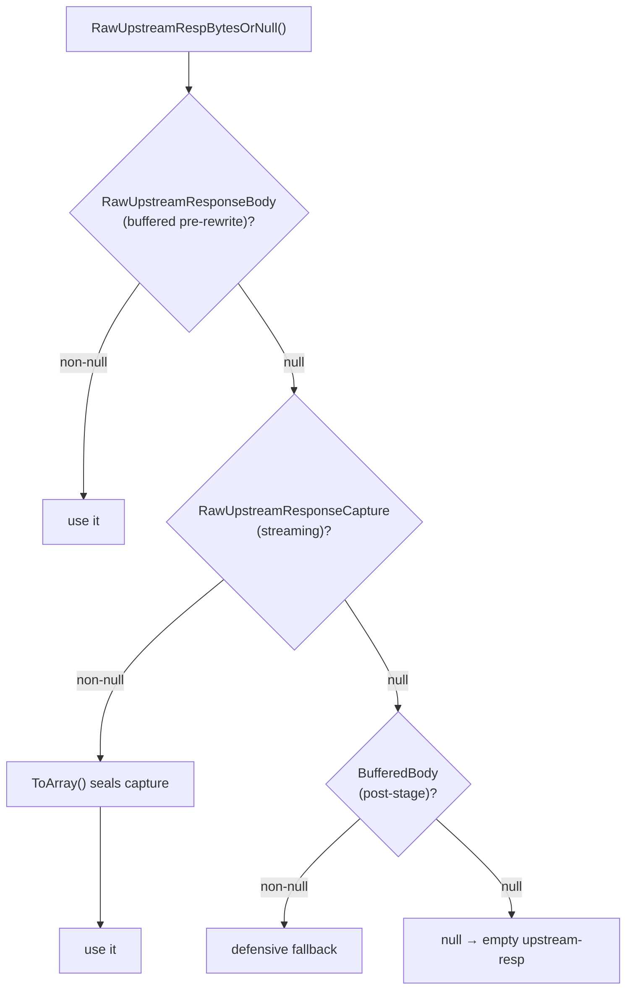

> **Side effect:** reading the streaming branch *finalizes* the capture. Call it
> exactly once, from the endpoint `finally`, after the relay loop has drained.

### 9.4 The capture buffer's lifecycle

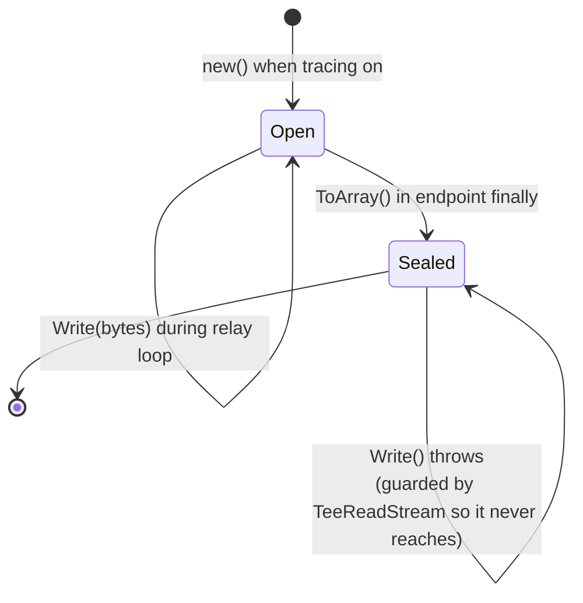

Write-then-read is ordered by `await` (the relay loop is awaited before the
`finally`), so no locking is needed. Sealing turns the documented ordering into an
enforced one.

### 9.5 Mid-stream fault

A fault while draining is handled differently per backend, but the **partial
capture is retained** either way:

- **`/cc` passthrough** lets the fault propagate to the endpoint's `catch`. The
  capture holds the bytes received before the break.
- **Codex `/responses`** catches the fault internally to flush a `response.failed`
  terminal, then surfaces it on `BridgeResponse.UpstreamStreamFault` so the
  endpoint can fold it into the audit's `error` field — otherwise a truncated
  `upstream-resp` would log as a clean 200.

---

## 10. The `upstream-req` body: exact POSTed bytes `[implemented]`

Two strategies compute the POST body differently; both must stash what they
actually sent so ② is a faithful witness.

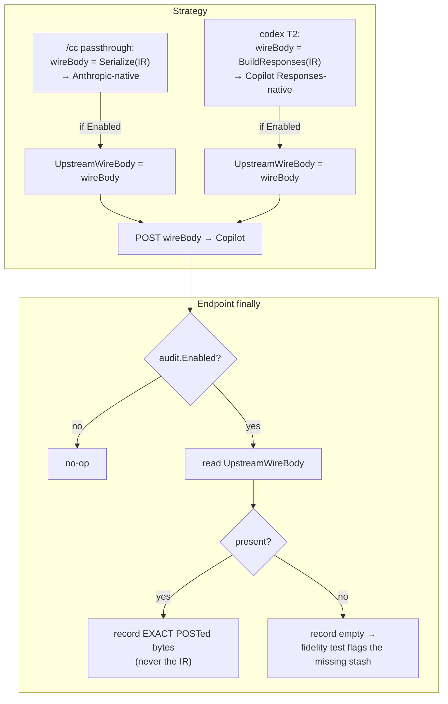

Both `wireBody` values are the **real Copilot-native POST bytes**, produced *via*
the IR but never equal to it: `/cc` serializes the IR to the Anthropic wire (the
IR happens to be Anthropic-shaped there), and Codex runs T2 to a Copilot Responses
body. `upstream-req` records that `wireBody` — the same array we POST — so it is
always the true upstream request, not the internal hub.


**Why stash instead of re-serialize.** Today the passthrough endpoint does
`UpstreamWireBody ?? Serialize(IR)` — an unconditional second serialize of a
multi-MB body, discarded off-trace. Stashing the bytes the strategy already
computed:

1. removes the redundant serialize (the perf win), and
2. makes ② the *exact* array the `CopilotClient` received — not a second
   serialization that could drift (field order, a future serializer option, a body
   mutated between POST and audit).

**Why `UpstreamWireBody` no longer means "which backend ran".** Once passthrough
also stashes, `null` no longer distinguishes passthrough from translate. Backend
identity was never this field's job — it lives on `bridgeCtx.Target.Vendor` (set
by `ModelRouterStage`, already read for the summary). The field collapses to one
meaning: *"the captured upstream wire bytes; non-null iff tracing is on and a
strategy ran."*

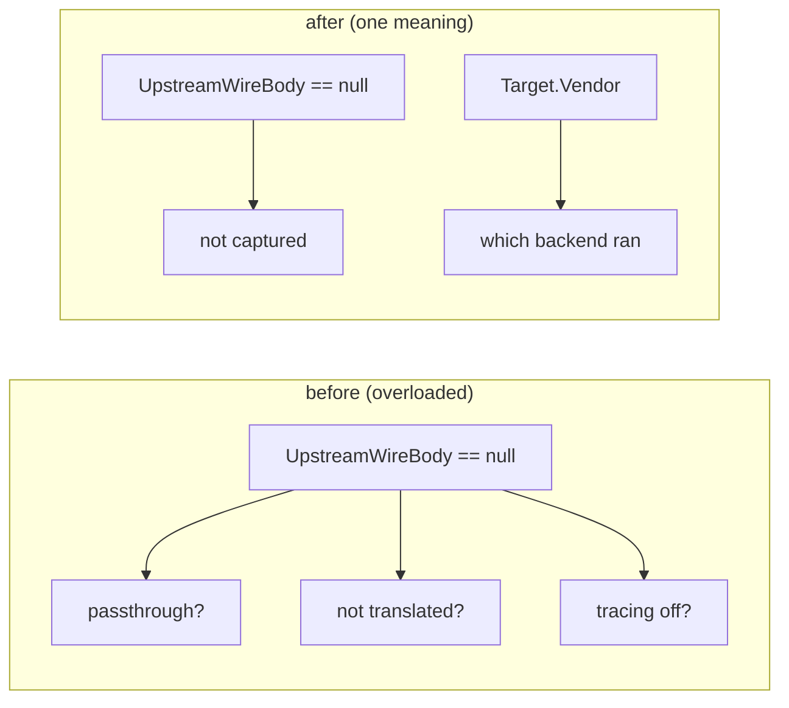

---

## 11. Operational properties `[as-built]`

### Back-pressure

The sink's channel is `Bounded(256, FullMode=Wait)`. When the writer can't keep up,
`Emit` blocks the request thread. This is deliberate: **audit completeness wins
over latency**. Under disk-bound load, request handling throttles to the writer's
rate rather than dropping artifacts.

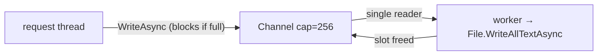

### Buffer ownership

Inbound bodies are read into `ArrayPool`-rented buffers to avoid GC pressure on
conversation-sized payloads, via `InboundBody.ReadPooledAsync` which returns a
disposable `PooledBody`. The endpoint consumes the body synchronously (deserialize
+ the audit capture) inside a `using` and the buffer returns to the pool within
that synchronous section — it does not cross `await` into the pipeline. The audit
copy (`RecordInbound`, tracing-on only) is a separate plain array the sink owns;
the sink's body is reclaimed by GC after the JSON is written (no pooling on the
sink side).

### Redaction

`Authorization`, `X-Api-Key`, `Anthropic-Auth-Token` header values become
`<redacted>` before serialization. Bodies are not scrubbed (OAuth tokens flow only
through `/login/device/*`, which never enters the audit path).

### Shutdown

`ProcessExit → Log.CloseAndFlush() → sink.Dispose()`:

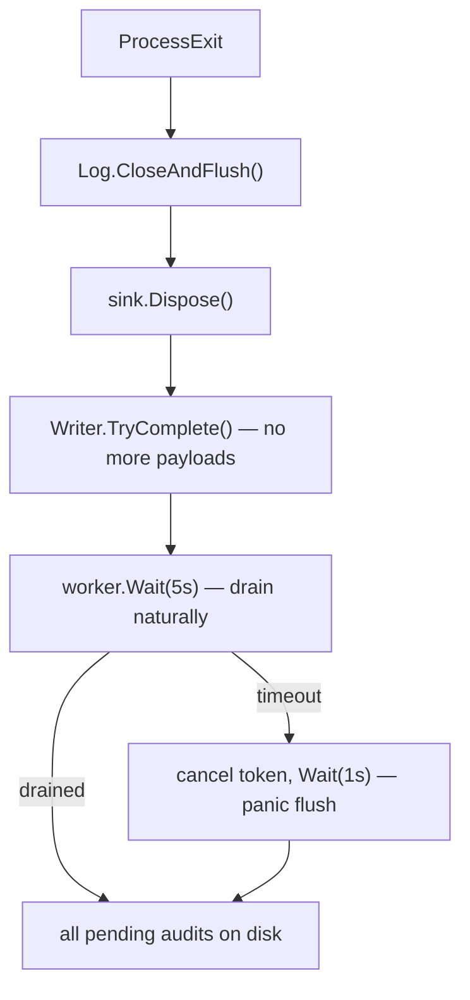

---

## 12. Invariants & how they are tested

The design's value is that these are enforceable at one place. Each has (or gets) a
from-contract test — asserting *required behaviour*, mutation-checked by breaking
the product code and watching the test go red.

| # | Invariant | Guarded by |
|---|---|---|
| I1 | **Zero overhead when off** — no capture/list allocated, no body serialized or copied for audit, no payload emitted. | `RequestAuditSeamTests.Cc_*_TracingOff_*` (zero events, null `UpstreamWireBody`, null capture); mutation-checked |
| I2 | **On-trace fidelity** — the four artifacts are byte-identical to a pre-refactor golden. | extended `UpstreamResponseAuditEndpointTests` |
| I3 | **`upstream-req` = exact POSTed bytes** on both backends. | `Cc_TracingOn_UpstreamReqEqualsExactPostedBytes` + `Codex_TracingOn_UpstreamReqEqualsPostedResponsesBytes`; mutation-checked |
| I4 | **`upstream-resp` = Copilot's raw pre-stage bytes**, even after model rewrite, streaming and buffered. | `UpstreamResponseCaptureContractTests` (both endpoints, both modes) |
| I5 | **Tee never perturbs the client stream** — downstream events byte-identical with the tee on. | `TracingOn_Streaming_ClientEventsIdenticalToNoTee` |
| I6 | **Partial capture survives a mid-stream fault**; the fault is surfaced (not logged as clean 200). | `Cc_MidStreamFault_*`, `Codex_MidStreamFault_*` |
| I7 | **One id on every surface** — files, summary, pipeline, enter/exit share the `BuildTraceId` id; never the 32-hex Activity id. | observability spec tests (summary + enter/exit) |

**Testing rule (project directive):** assert the contract, not the implementation.
A capture test that reads the current code and asserts it back freezes bugs. State
the invariant in words first ("given X, the audit must contain Y, because Z"), then
assert observable bytes/events. A new test that passes on the first run is
suspect — mutation-check it.

---

## Appendix A — File map

| Concern | File |
|---|---|
| Flag + emissions seam `[implemented]` | `Pipeline/RequestAudit.cs` |
| Audit emission API | `Hosting/Logging/BridgeIoLoggerExtensions.cs` |
| EventIds 1001–1004 | `Hosting/Logging/BridgeIoEvents.cs` |
| Audit payload DTO | `Hosting/Logging/BridgeIoPayload.cs` |
| Sink (channel + worker + JSON) | `Hosting/Logging/BridgeIoSink.cs` |
| Serilog wiring / split | `Hosting/Logging/SerilogBootstrapper.cs` |
| Trace-id prefix enricher | `Hosting/Logging/ReqTraceFormatEnricher.cs` |
| Trace id + seq | `Hosting/Logging/BridgeIoSeq.cs` (in `BridgeIoLoggerExtensions.cs`) |
| Raw capture + tee | `Pipeline/RawResponseCapture.cs` |
| Capture result slots + accessor | `Pipeline/BridgeContext.cs` (`BridgeResponse`) |
| Config toggle | `Hosting/Options/TracingOptions.cs` |
| Endpoints (audit call sites) | `Endpoints/ClaudeCode/ClaudeCodeMessagesEndpoint.cs`, `Endpoints/Codex/CodexResponsesEndpoint.cs`, `Endpoints/ClaudeCode/ClaudeCodeCountTokensEndpoint.cs` |
| Strategies (wire-body stash + capture) | `Pipeline/Strategies/Anthropic/CopilotMessagesPassthroughStrategy.cs`, `Pipeline/Strategies/Codex/CopilotResponsesStrategy.cs` |

## Appendix B — Config

```jsonc
// appsettings.json
"Tracing": {
  "Enabled": false,              // off by default; captures full prompts/responses
  "Directory": "request-traces"  // relative to the .exe unless absolute
}
```

Flip `Enabled` to `true` and restart to capture; the startup banner reports the
state (`Req trace: enabled/disabled`). Turn off again when done — the audit holds
user prompts verbatim.
